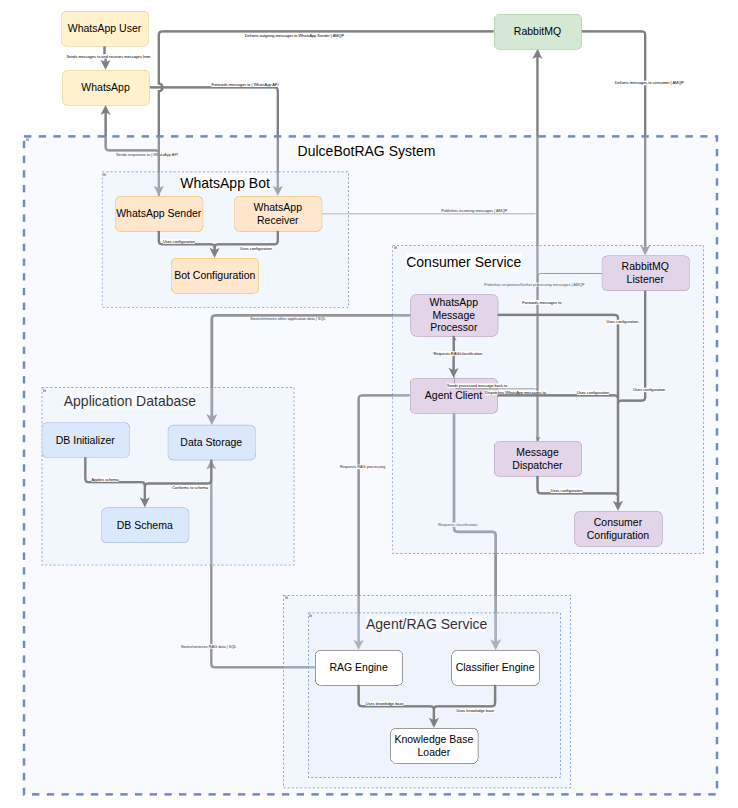

# Agente RAG para WhatsApp

**Qué hace**  
- Responde entrevistas y soporte vía WhatsApp.  
- Recupera conocimiento (RAG) desde `.md/.json` con autodiscovery.  
- Orquestación con RabbitMQ y Docker.

**Stack**  
Python (embeddings + retrieval) · Node.js (bots) · RabbitMQ · Docker · (opcional) PostgreSQL/MSSQL.

## Demo
- 🎥 Video mostrando el flujo end-to-end.
- 🖼️ Capturas: `images/`

## Arquitectura


## Puesta en marcha
```bash
# 1) Clona el repositorio
git clone https://github.com/AgusBM/DulceBotRAG.git
cd DulceBotRAG

# 2) Carga tus archivos md o txt en las carpetas de conocimiento, en la carpeta classifier carga algunos documentos de muestra que permita clasificar el mensaje recibido y escoger entre el agente de soporte y el agente de servicio. En la carpeta consumer carga toda la base de conocimiento.
├── agent/            
│   ├── classifier/
│          ├── order/
│          └── support/
│   └── consumer/
│          ├── order/
│          └── support/

# 2) Inicia LMStudio y carga tu modelo LLM favorito
../squashfs-root/./lm-studio

# 3) Actualiza las variables de entorno .env y config.py
cp .env.example .env
# Rellena ENDPOINT_URL, API_KEY, MODEL_ID, RABBITMQ_USER/PASSWORD, etc.

# 4) Inicia RabbitMQ en Docker
docker compose up --build -d

# 5) Inicia el Bot de WhatsApp, la primera vez te mostrara un QR para enlazar con tu dispositivo
node whatsapp-bot/index.js

# 6) Inicia el consumer de WhatsApp
python consumer/whatsapp_consumer.py


